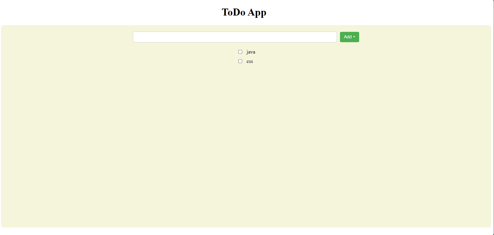

# TodoApp

A simple and elegant Todo application built with React and Vite.

## Screenshots



## Features

- ✏️ Add new todo items
- ✅ Mark todos as complete/incomplete
- 📋 View all your todos in a clean list
- 💾 Persistent state during session

## Tech Stack

- **React** - Frontend library for building user interfaces
- **Vite** - Fast build tool and development server
- **JavaScript** - Programming language

## Getting Started

### Prerequisites

- Node.js (v18 or higher)
- npm or yarn

### Installation

1. Clone the repository:
```
bash
git clone <your-repo-url>
```

2. Navigate to the project directory:
```
bash
cd ToDoApp
```

3. Install dependencies:
```
bash
npm install
```

### Running the Application

Start the development server:
```
bash
npm run dev
```

Open your browser and visit `http://localhost:5173`

### Building for Production

To create a production build:
```
bash
npm run build
```

## Project Structure

```
ToDoApp/
├── public/              # Static assets
├── src/
│   ├── App.jsx         # Main application component
│   ├── App.css         # Application styles
│   ├── index.css       # Global styles
│   └── main.jsx       # Application entry point
├── index.html          # HTML template
├── package.json        # Project dependencies
└── vite.config.js     # Vite configuration
```


## License

MIT
